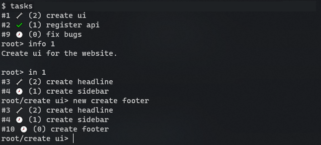

# tasks
Little script that can be used to create recursive todo list.



## How to install

### Install ncurses

```
sudo apt-get install libncurses-dev
```

### Add to .bashrc

You can install this app by adding it as alias to .bashrc:

```
echo -e alias tasks=\"python3 $(pwd)/tasks.py\" >> ~/.bashrc
source ~/.bashrc
```
